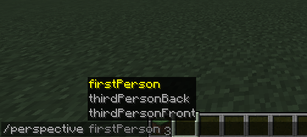
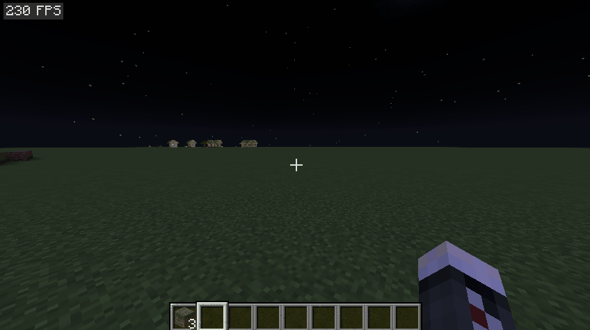

# FinerF5
A simple [Minecraft](https://www.minecraft.net/) mod that provides more refined control to your perspective switching
## Description
+ I made this mod to address the disorientation I feel when doing a quick perspective switching to peek and the game goes through the third perspective(front) essentially reversing the control, especially when on motive, which kind of makes me dizzy.
+ Aviliable controls
  - Toggle between 1st & 3rd back (default: `F6`)
  - Toggle between 1st & 3rd front (default: `F7`)
  - Toggle between 3rd back & front (default: `None`)
    > Note: The toggle button will always switch to the primary perspective if not in any two modes can be toggled between, e.g. when you use the 1st & 3rd back toggle and you are in the 3rd front, you will be switched to 1st perspective.
  - Switch to 1st (default: `None`)
  - Switch to 3rd back (default: `None`)
  - Switch to 3rd front (default: `None`)
  - Perspective command
  - Perspective selector - pop (default: `O`)
  - Perspective selector - next (default: `P`)
    > Note: Perspective selector is pretty much a reskinned game mode selector with keys remappable, it behaves almost the same besides it does not memorize your previous perspective since if you want to switch faster use the toggle keys. It pops the window straight up without needing to press the switch key since I think it is kind of superfluous.
  
## Demo
+ 1st & 3rd back toggle

+ 1st & 3rd front toggle

+ 3rd back & front toggle

+ Perspective command

+ Perspective selector
